# T3A2-A - Recipe Realm

#### *Kenny Lai, John Masters, Vicky Nie*

---

## Table of Contents

- [Description of your website](#r1---description-of-your-website)
    - [Purpose](#purpose)
    - [Functionality/features](#functionalityfeatures)
    - [Target audience](#target-audience)
    - [Tech stack](#tech-stack)
- [Dataflow Diagram](#r2---dataflow-diagram)
- [Application Architecture Diagram](#r3---application-architecture-diagram)
- [User Stories](#r4---user-stories)
- [Wireframes](#r5---wireframes)
    - [Hand Sketch](#hand-sketch)
    - [Low Fidelity Wireframes](#low-fidelity-wireframes)
    - [Medium Fidelity Wireframes](#medium-fidelity-wireframes)
    - [Desktop Views](#desktop-views)
    - [Tablet Views](#tablet-views)
    - [Mobile Views](#mobile-views)
    - [User Login Flow](#user-login-flow)
- [Project Management \& Trello board screenshots](#r6---project-management--trello-board-screenshots)

## R1 - Description of your website

### Purpose

This app is designed to help cooks of all skill levels to discover, save, and submit their recipes.

### Functionality/features

- A large and inviting display of recipe photos with recipe names that will let users browse and select recipes.
- The list of recipes will be able to be filtered based on name, cuisine, dietary requirements, complexity, ingredients, and more.
- A daily random featured recipe that has a high rating.
- Recipes will be displayed to be simple and easy to follow.
- Navigation bar for easy access to different site content.
- Users can submit their own recipes to the community.
- Users will be able to leave public comments on recipes.
- Users can rate recipes.
- Users will be able to save recipes to their favourites profile for quick access to the meals they enjoyed making or plan to try later.

### Target audience

The target audience of the app are home cooks, busy individuals, and those with dietary requirements.  

### Tech stack

**Deployment:** Railway  
**Front-end:** HTML, CSS, Bootstrap, JavaScript, React  
**Back-end:** Node.js, Express, MongoDB, Mongoose

## R2 - Dataflow Diagram

Gane and Sarson notation:

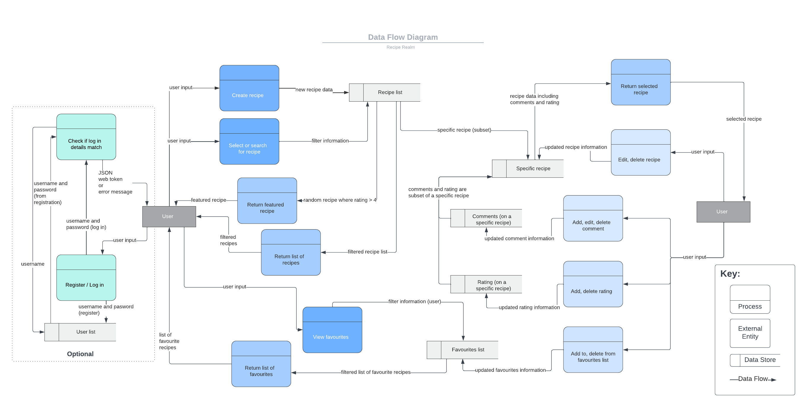

## R3 - Application Architecture Diagram

## R4 - User Stories

- As a busy parent, I want to easily access my favourite recipes, so I can make meals I know my family will enjoy.
- As a busy parent, I want to see popular recipes without having to read a thousand words, as I am always on the move and don’t have time to sit and read.
- As an adventurous eater, I want to be able to filter recipe searches, so that I can easily find recipes from specific cuisines or categories.
- As a vegetarian, I want to find recipes that meet my dietary requirements so I can make vegetarian dishes.
- As someone who works from home, I want to find recipes that use the ingredients I already have.
- As someone new to cooking, I want to be able to ask questions regarding a recipe so I can clarify certain details.
- As someone new to cooking, I want to find beginner recipes that can let me make great meals without too much stress.
- As a user I want to review and rate recipes, so I can let others know how the meal turned out.
- As someone who doesn’t know what to cook, I want a recipe suggestion daily so I don't have to think about it.
- As someone who loves cooking, I want to be able to upload my own recipes and receive feedback from other users so I can share and improve my skills.
- As a busy person, I want apps to be modern and user friendly so I can use the site easily.
- As a design student, I want the app take into consideration accessibility so people are not excluded.

## R5 - Wireframes

The following wireframes were created using Figma and will provide a visual representation of the Recipe Realm app. The wireframes will show the layout of the app on different devices, and the user interaction flow.

The app will consist of the following main pages, with subpages where necessary:

- Index page where they will view, search and filter recipes
- Single recipe page where they will view the recipe details
- Login page where they will be able to login to their account, or register for a new account
- User home page where they will be able to view their saved recipes, comments, ratings, and submitted recipes  

###### *User login and user homepage for comments and ratings are optional features based on time allowance

### Hand Sketch

During the concept stage of the project, a rough hand sktech was create to layout what pages the app would have a basic layout of the pages.

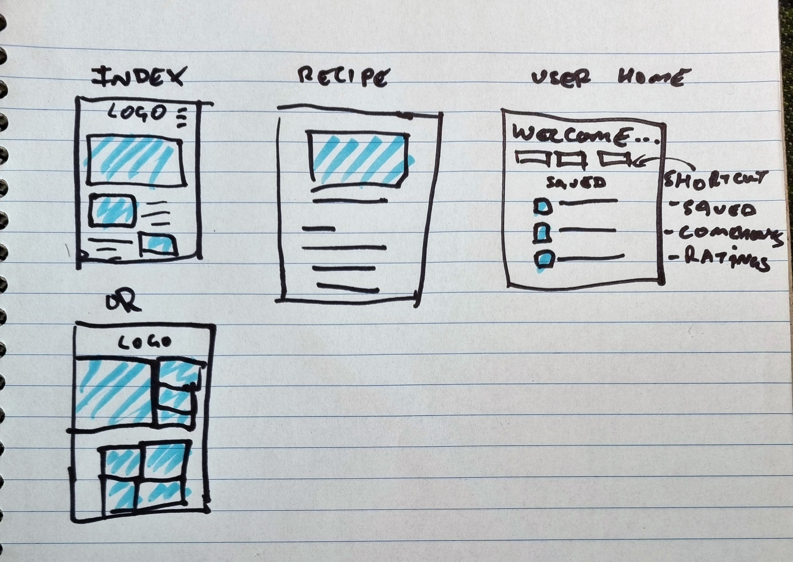

### Low Fidelity Wireframes

From the hand sketches a low fidelity digital wireframe was created of each page.

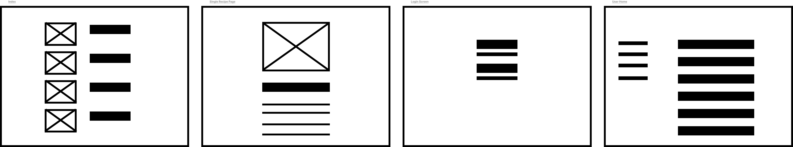

### Medium Fidelity Wireframes

When the low fidelity wireframes were approved, medium fidelity wireframes was created, showing more detail of the features of the app and how the layout will appear on different devices.

### Desktop Views

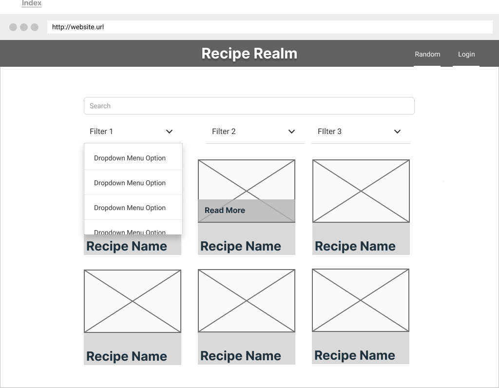  

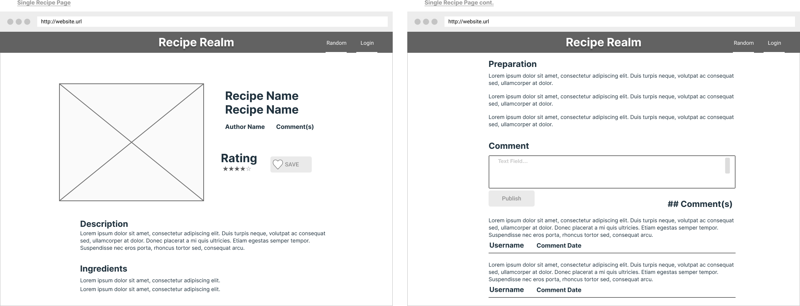

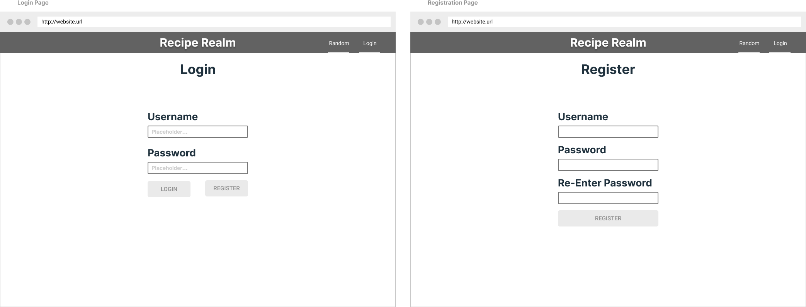

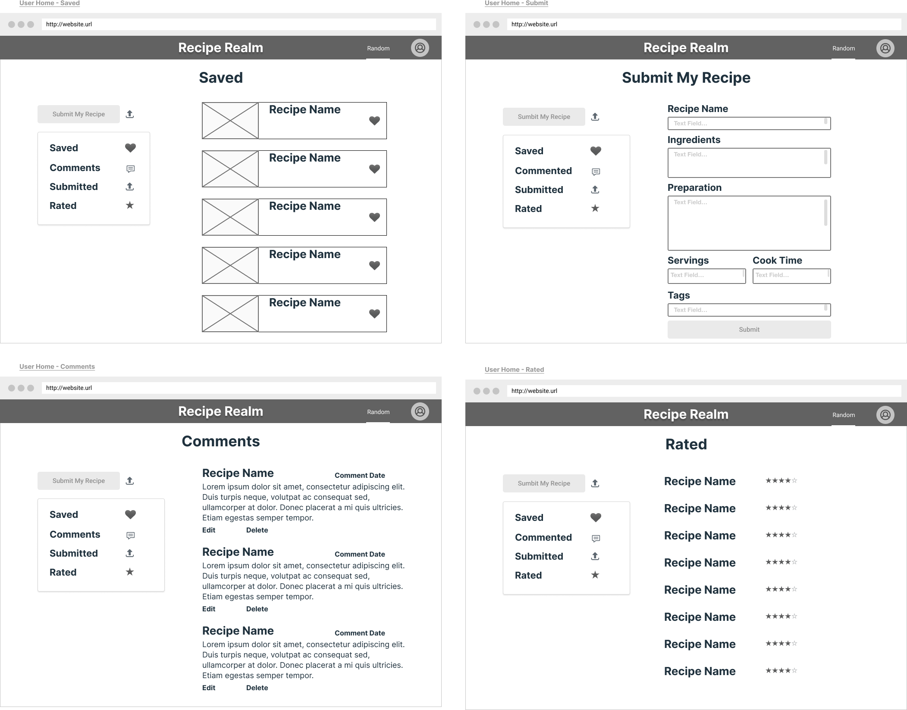

### Tablet Views

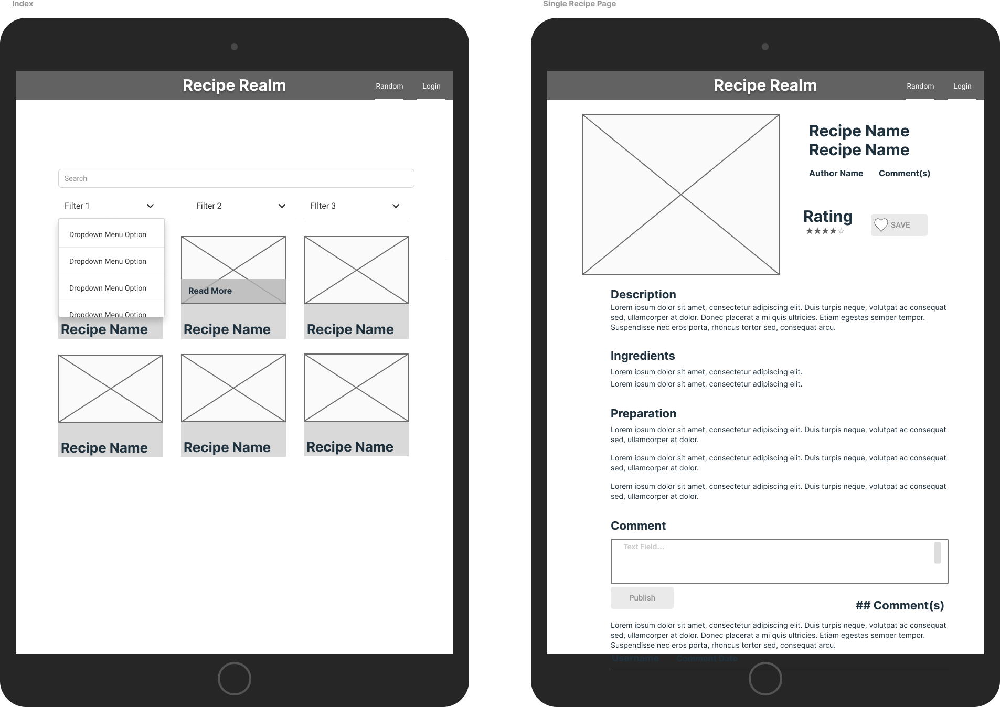

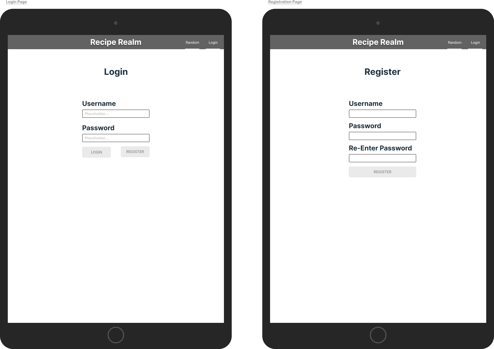

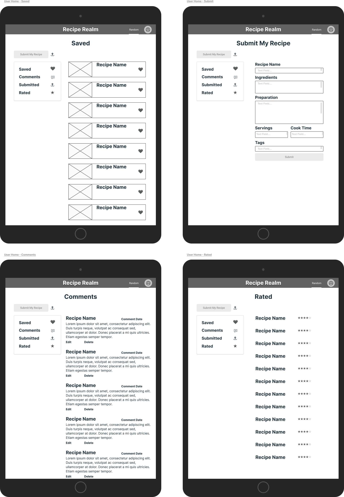

### Mobile Views

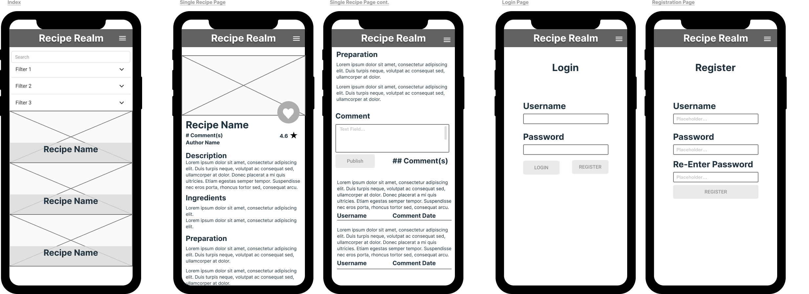

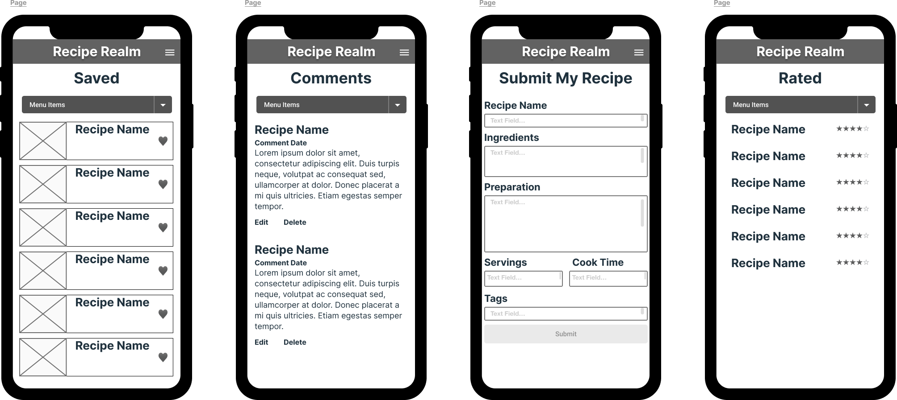  
  
### User Login Flow

Below is an example of a user interaction flow when using the Recipe Realm app. This flow will show how a user would navigate to their user home page, where they are able to see their saved recipes, comments, ratings, and submitted recipes.

1. To find the login page the user will click on the hamburger menu
2. From the menu shade, the login button will be clicked
3. They will be redirected to the login page and will enter their username and password
4. They will be redirected to their user home page  

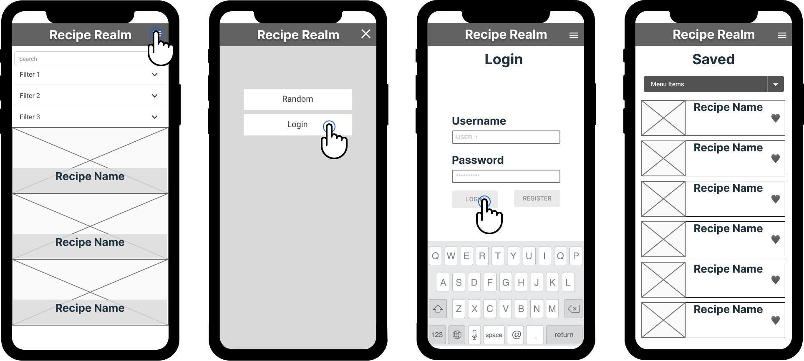

## R6 - Project Management & Trello board screenshots

For this project we have decided to use the Agile methodology for project management. This will see the quick completion of tasks, daily stand ups of what tasks have been completed and will be completed in the next 24 hours, and flexibility to changes to the requirements to the project.

This will be managed is Trello, a Kanban style project management tool, where individual tasks are noted on seperate cards. Each card will have properties to determine which member of the group it is assigned to, when it is due, and the estimated time to complete the task. Within the cards there are also sub-lists, to further breakdown the tasks and allow for incremental progress to be seen.

### Screenshot on 13/01/2023

### Screenshot on 16/01/2023

### Screenshot on 18/01/2023

### Screenshot on 19/01/2023

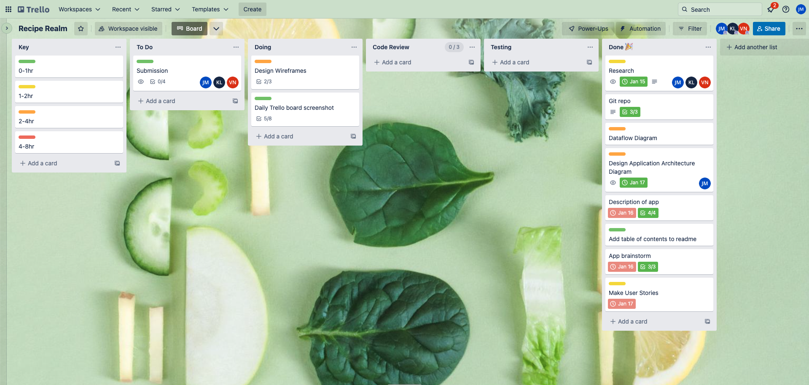

### Screenshot on 21/01/2023

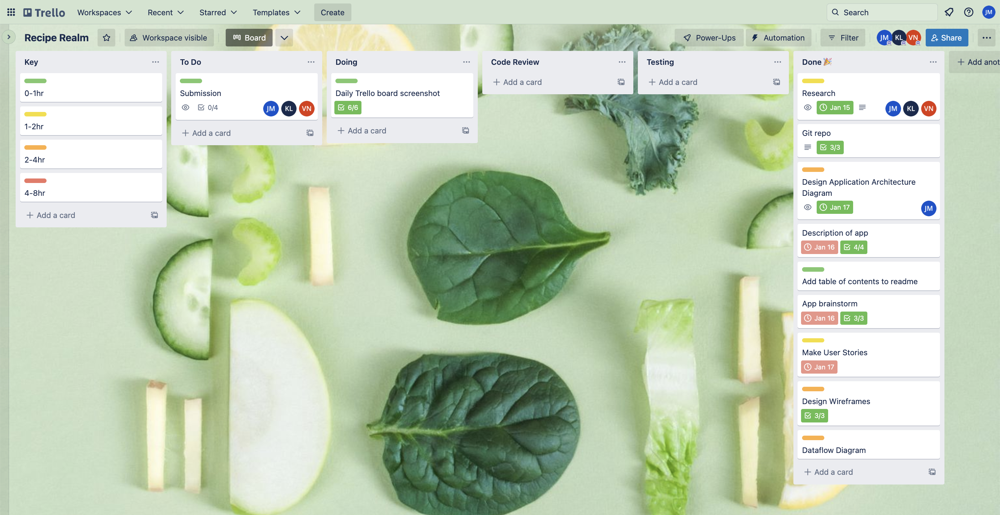

