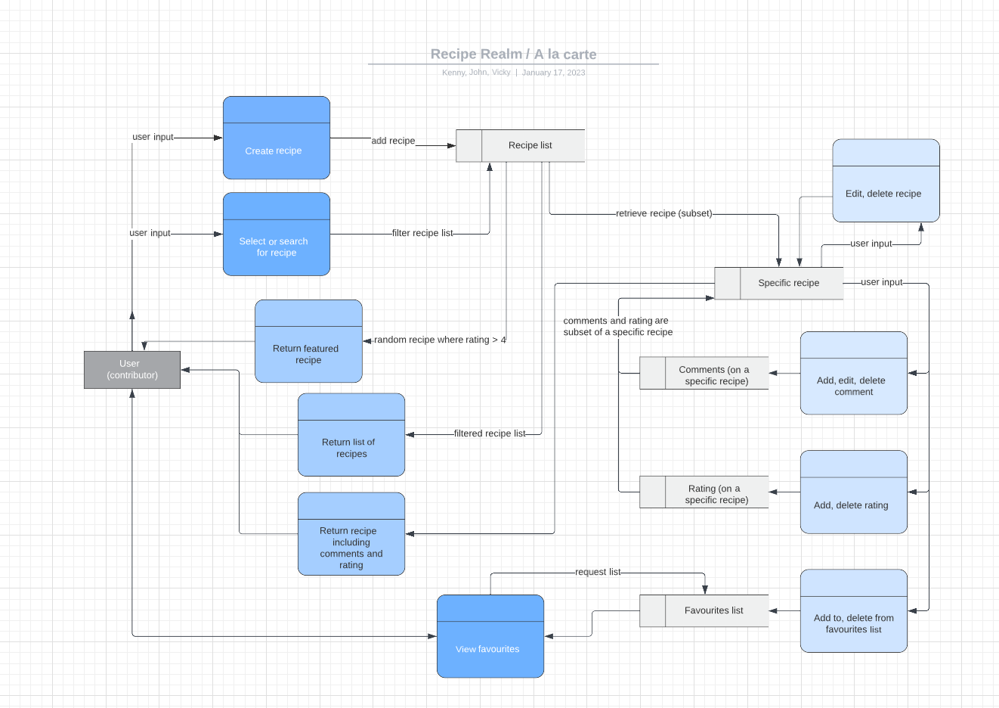
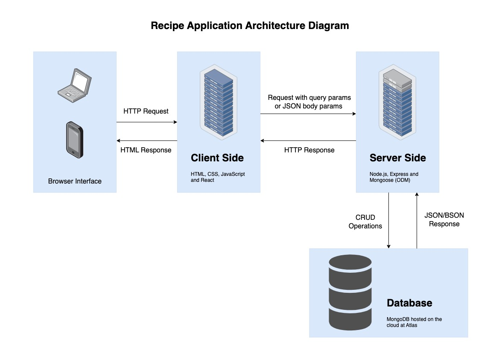
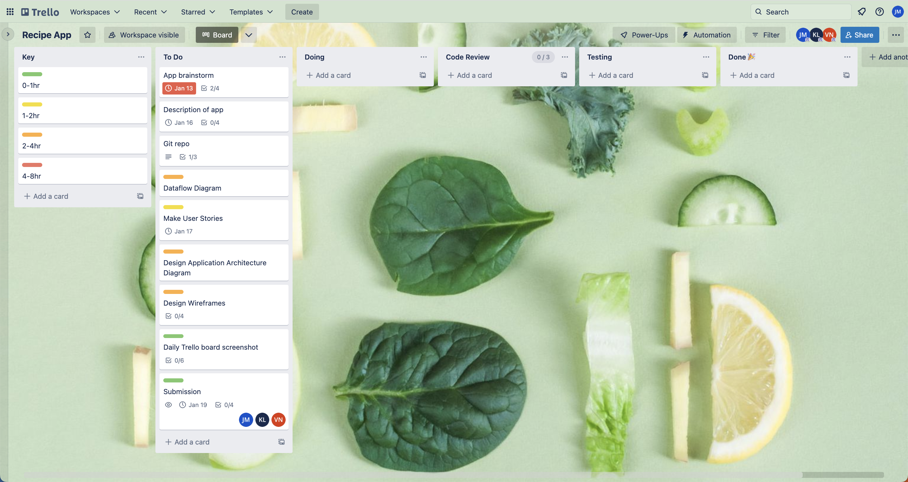
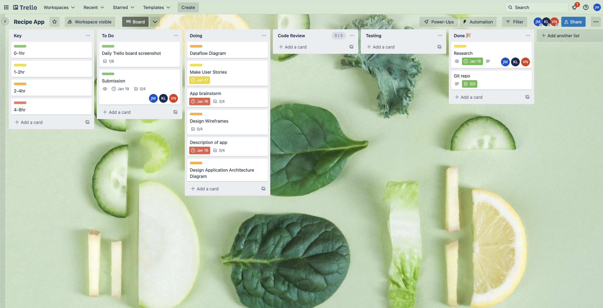
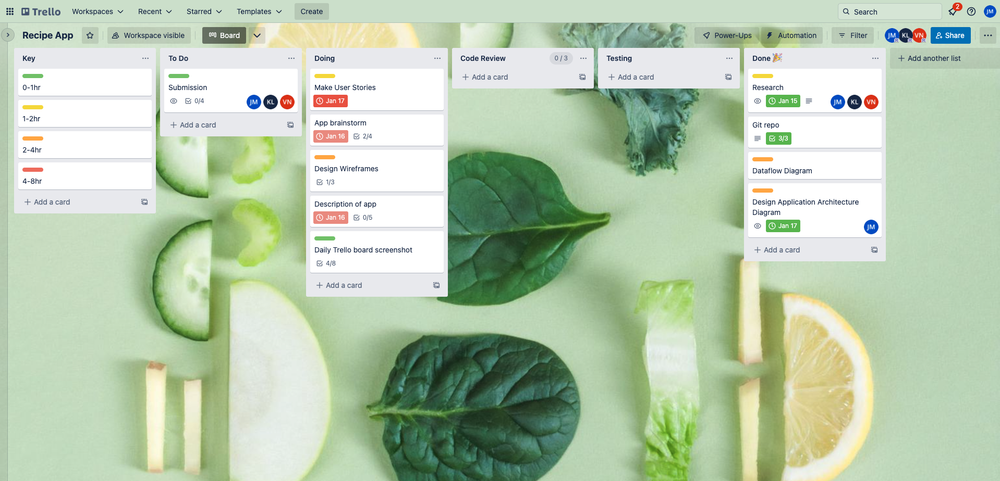

# T3A2-A

Kenny Lai, John Masters, Vicky Nie

## R1 - Description of your website

### Purpose
This app is designed to help cooks of all skill levels to discover, save, and submit their recipes. 

### Functionality/features
- A large and inviting display of food photos will let users browse and see what they can expect the dishes will look like.
- The list of recipes will be able to be filtered based on cuisine, dietary requirements and complexity.
- Users will be able to leave a public comment and a rating.
Recipes will be displayed to be simple and easy to follow.
- Users will be able to save recipes to their profile for quick access to the meals they enjoyed making or plan to try later.
- Users will be able to submit their own recipes to the community.

### Target audience
The target audience of the app are home cooks, busy individuals, and those with dietary requirements.  

### Tech stack
**Deployment:** Railway  
**Front-end:** HTML, CSS, Bootstrap, JavaScript, React  
**Back-end:** Node.js, Express, MongoDB, Mongoose
## R2 - Dataflow Diagram

Gane and Sarson notation:

## R3 - Application Architecture Diagram

## R4 - User Stories

## R5 - Wireframes

## R6 - Screenshots of your Trello board throughout the duration of the project

### Screenshot on 13/01/2023

### Screenshot on 16/01/2023

### Screenshot on 18/01/2023

